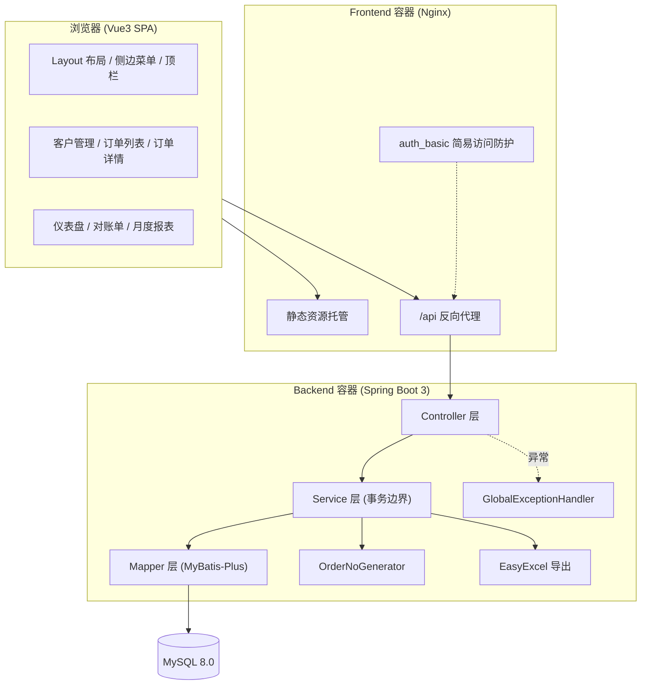

## 产品概述

面向中小供货商的轻量订单与欠款管理 ERP，替代 Excel 手工台账，覆盖「客户 → 订单 → 出货 → 收款 → 欠款 → 报表」业务闭环。

## 核心功能

- **客户管理**：客户增删改查，字段含公司名称（唯一）、联系人、电话、信用额度，列表展示实时欠款
- **订单管理**：订单录入、多条件筛选分页、自动生成内部订单号、支持填写客户订单号（PO 号）
- **订单状态机**：录入 draft → 待出货 pending → 待付款 shipped → 已完成 paid；draft/pending 可取消，shipped/paid 禁止取消，已取消不计入欠款
- **出货管理**：生成出货单（发货日、物流单号），确认发货推进至待付款
- **收款管理**：仅待付款订单可收款，支持分批多次收款，累计达额自动完成，校验禁止超收款
- **欠款统计**：按「仅已出货计应收」口径统计系统总欠款与客户欠款，仪表盘展示账龄分布
- **客户对账单**：按客户聚合订单、出货、收款明细，支持 Excel 导出
- **月度经营报表**：订单量、出货量、回款金额、完成率，支持 Excel 导出

## 实施范围覆盖（用户要求的 10 个阶段）

项目初始化、需求分析、技术选型、详细设计、开发计划、测试方案、部署上线、培训与文档、验收交付、运维优化，共 8 周工期，1 人全栈。

## 交付形态

先输出精简实施计划，随即搭建 SpringBoot + Vue3 工程骨架并按三个迭代实现全部功能，最终交付可运行系统 + 配套文档。

## 关键业务决策（本轮确认）

1. 欠款口径：**仅 shipped 状态计入应收欠款**，draft、pending、cancelled、paid 均不计入应收
2. 订单编号：系统自动生成内部单号 `ORD+yyyyMMdd+4位流水`，不可手改；**新增客户订单号（PO 号）选填字段**用于与客户对账与检索
3. 团队：1 人全栈，工期由原 4 周放宽至 8 周

## 一、技术栈选型

沿用规划文档已定技术栈，并按实施需要补齐组件：

| 层 | 选型 | 说明 |
| --- | --- | --- |
| 后端 | Spring Boot 3.2.x + JDK 17 | 与文档一致 |
| ORM | MyBatis-Plus 3.5.x | 分页插件、Lambda QueryWrapper |
| 数据库 | MySQL 8.0（utf8mb4_unicode_ci） |  |
| Excel | EasyExcel 3.3.x | 流式写出，避免 POI 大对象内存溢出 |
| 接口文档 | springdoc-openapi 2.x | 自动生成接口页，降低自测与联调成本 |
| 参数校验 | spring-boot-starter-validation | DTO 层注解校验 |
| 前端 | Vue 3.4 + Vite 5 + TypeScript |  |
| UI | Element-Plus 2.x（自动按需导入） |  |
| 状态/路由 | Pinia + Vue Router 4 |  |
| 图表 | ECharts 5 + vue-echarts | 仪表盘账龄分布、月度趋势 |
| 部署 | Docker Compose（mysql / backend / frontend-nginx） |  |


**关键取舍**：

- 选 EasyExcel 而非 Apache POI：导出对账单/月报为流式写，10 万行级数据内存可控，API 更简洁
- 不加权限框架：文档明确排除权限。上线防护改用**零代码方案** —— Nginx `auth_basic` 一层 HTTP Basic，部署阶段配置即可，不侵入业务代码
- 不加消息队列、缓存、分布式锁：10 人并发、单体部署，属于过度设计

## 二、核心业务规则设计

### 2.1 欠款口径（三档金额模型）

用户确认「仅已出货计应收」。为避免 draft/pending 金额信息丢失，仪表盘按三档分列展示：

| 档位 | 口径 | 说明 |
| --- | --- | --- |
| 在录金额 | `status='draft'` 的 total_amount 合计 | 未排产，不计应收 |
| 待发货金额 | `status='pending'` 的 total_amount 合计 | 已排产未发货，不计应收 |
| **应收欠款** | `status='shipped'` 的 `SUM(total_amount) - SUM(payments.amount)` | **唯一计入欠款的档位** |
| 已结清 | `status='paid'` | 欠款为 0 |
| 已取消 | `status='cancelled'` | 完全排除 |


统计 SQL 统一过滤：`o.status = 'shipped'`，并使用 `LEFT JOIN payments` 后按订单先聚合收款再相减，避免多笔收款导致的金额放大（原文档 SQL 存在 `SUM(o.total_amount)` 被 payments 行放大的经典缺陷，必须修正）。

### 2.2 账龄分布（FR-08）

- 起算基准：**实际发货日 `shipments.shipment_date`**（未发货不产生应收，符合上述口径）
- 分档：0-30 天 / 31-60 天 / 61-90 天 / 91 天以上
- 统计对象：`status='shipped'` 且未结清订单，按「订单金额 - 已收金额」的未结余额归属档位
- 实现：SQL `DATEDIFF(CURDATE(), s.shipment_date)` 分档后 `GROUP BY`，一次查询出四档金额

### 2.3 订单编号生成（并发生成方案）

采用**按日序列表 + 事务内自增 + 唯一索引兜底**：

- 新增表 `order_no_sequence(biz_date PK, current_val)`
- 生成时机：在创建订单的**同一事务**内执行
`INSERT INTO order_no_sequence(biz_date,current_val) VALUES(?,1) ON DUPLICATE KEY UPDATE current_val=current_val+1`
再 `SELECT current_val WHERE biz_date=?`，拼成 `ORD + yyyyMMdd + 4位补零流水`
- 并发安全：UPSERT 本身原子；`orders.order_no` 唯一索引兜底，捕获 `DuplicateKeyException` 后重试最多 3 次
- 规则封装在 `OrderNoGenerator` 策略类中，格式前缀与位数可配置，便于替换

### 2.4 客户订单号（PO 号）

- `orders.customer_order_no VARCHAR(64)` 选填
- **不做全局唯一约束**，仅在同一客户下重复时给前端软提示（不阻断录入）—— 供货商场景中不同客户可能给出相同 PO 编号
- 支持在订单列表按客户订单号模糊检索，对账单中展示，便于与客户对账

### 2.5 出货单与确认发货

文档 ER 图中 `orders 1:1 shipments`，且 ship 动作发生在 draft→pending（尚未实际发货），故明确：

- `POST /{id}/ship`：创建 shipment 记录，`shipment_date` 记录**计划发货日**，`tracking_no` 选填 → draft→pending
- `POST /{id}/confirm-ship`：更新 `shipment_date` 为**实际发货日**、补齐 `tracking_no` → pending→shipped，此时才形成应收

### 2.6 收款与超收款校验

- 仅 `shipped` 状态可收款（修正文档原文允许 pending 收款的缺陷）
- 校验：`已收金额 + 本次收款 <= total_amount`，超出抛 `BusinessException` 明确提示
- 分批收款：累计等于总额时自动流转 `paid`
- 全流程 `@Transactional`，保证收款记录与订单状态原子一致

## 三、系统架构



分层职责：Controller 仅做参数接收与结果封装；**Service 为唯一事务边界与业务规则落点**；Mapper 只做数据访问与聚合统计。

## 四、数据库设计（最终 DDL 变更点）

在文档 7.2 节五张表基础上做如下调整：

**orders 表新增字段**

```sql
ALTER TABLE orders
  ADD COLUMN customer_order_no VARCHAR(64) NULL COMMENT '客户订单号/PO号（选填，对账用）' AFTER order_no,
  ADD COLUMN due_date DATE NULL COMMENT '约定付款到期日（选填，仅展示）',
  ADD INDEX idx_customer_order_no (customer_order_no),
  ADD INDEX idx_cust_po (customer_id, customer_order_no);
```

**新增订单号序列表**

```sql
CREATE TABLE order_no_sequence (
    biz_date     DATE PRIMARY KEY COMMENT '业务日期',
    current_val  INT NOT NULL DEFAULT 0 COMMENT '当日已发放最大流水号',
    updated_at   DATETIME DEFAULT CURRENT_TIMESTAMP ON UPDATE CURRENT_TIMESTAMP
) COMMENT '内部订单号按日流水序列表';
```

**其余保留**：`customers`、`shipments`、`payments`、`order_items` 沿用文档 DDL；`orders.status` 保留 ENUM 约束作数据层兜底；时区统一 `Asia/Shanghai`。

## 五、模块划分与后端分包

```
com.erp
├── common      Result<T> / PageResult<T> / BusinessException / GlobalExceptionHandler
├── config      MybatisPlusConfig(分页插件) / CorsConfig / JacksonConfig(BigDecimal精度)
├── customer    CustomerController / Service / Mapper / entity.Customer / vo.CustomerVO
├── order       OrderController / OrderService / OrderMapper / entity.Order
│               OrderNoGenerator / enums.OrderStatus / dto.ShipDTO / dto.PaymentDTO
├── shipment    ShipmentService / ShipmentMapper / entity.Shipment
├── payment     PaymentService / PaymentMapper / entity.Payment
├── dashboard   DashboardController / Service（总欠款、三档金额、账龄分布）
└── report      ReportController / Service（对账单、月度报表、EasyExcel 导出）
```

前端视图：`dashboard / customer / order-list / order-detail(抽屉) / statement / monthly-report`。

## 六、工程目录结构

```
d:/kaifa/erp/
├── 简易ERP系统软件开发规划文档.md      # [保留] 原始需求依据
├── README.md                          # [NEW] 项目说明、启动方式、目录导航
├── .gitignore                         # [NEW] 忽略 target/node_modules/.env/mysql-data
├── docs/
│   ├── 01-项目章程与里程碑.md           # [NEW] 目标、范围、1人全栈分工、里程碑与交付物
│   ├── 02-需求规格与验收标准.md         # [NEW] FR/NFR 清单、优先级、可度量验收标准
│   ├── 03-技术选型说明.md              # [NEW] 选型对比与取舍理由、第三方服务与部署环境
│   ├── 04-详细设计.md                 # [NEW] 架构图、DDL、接口定义、状态机、模块划分
│   ├── 05-开发计划与代码规范.md         # [NEW] 迭代拆解、编码规范、Git 分支与提交规范
│   ├── 06-测试方案与用例清单.md         # [NEW] 四层测试策略、用例清单、质量门禁
│   ├── 07-部署运维手册.md              # [NEW] 部署流程、回滚策略、备份恢复、监控告警
│   └── 08-用户操作手册.md              # [NEW] 面向业务人员的操作图文说明
├── backend/
│   ├── pom.xml                        # [NEW] Spring Boot 3.2 父依赖 + MP/EasyExcel/springdoc
│   ├── Dockerfile                     # [NEW] 多阶段构建，JRE17 运行镜像
│   └── src/main/java/com/erp/...      # [NEW] 上述分包全部类
│   └── src/main/resources/
│       ├── application.yml            # [NEW] 数据源(带 serverTimezone=Asia/Shanghai)、端口、MP 配置
│       └── application-test.yml       # [NEW] 指向 erp_test 库
│   └── src/test/java/com/erp/...      # [NEW] Service 单测 + 关键链路集成测试
├── sql/
│   ├── init.sql                       # [NEW] 全量建表 DDL（含新增字段与序列表），挂载到容器初始化目录
│   └── sample-data.sql                # [NEW] 演示/测试数据，便于自测与培训
├── frontend/
│   ├── package.json / vite.config.ts  # [NEW] Vue3+TS+ElementPlus 按需导入
│   ├── Dockerfile                     # [NEW] build 后由 Nginx 托管
│   ├── nginx.conf                     # [NEW] 反向代理 /api、history 路由 fallback、auth_basic
│   └── src/{api,views,router,layout,utils,types}
└── docker-compose.yml                 # [NEW] mysql/backend/frontend 三服务，挂载 sql/ 到 initdb 目录
```

## 七、迭代计划与里程碑（8 周，1 人全栈）

| 周次 | 阶段 | 任务 | 可验证交付物 |
| --- | --- | --- | --- |
| W1 | ①初始化 ②③④需求/选型/详细设计 | 建 Git 仓库与分支规范；产出 docs/01-04；定稿 DDL 与接口契约 | 4 份设计文档 + init.sql + 评审通过的接口清单 |
| W2-W3 | ⑤开发 · 迭代1 | 后端骨架（Result/异常处理器/MP 配置/OrderNoGenerator）；客户 CRUD；订单 CRUD；订单列表筛选分页；前端工程初始化、布局路由、客户与订单页面 | 客户、订单基础增删改查可用，订单号自动生成 |
| W4-W5 | ⑤开发 · 迭代2 | 状态机全套（ship/confirm-ship/pay/cancel）；超收款校验；draft 编辑约束；事务与异常；前端订单详情抽屉、出货与收款交互 | 完整正向流程与取消流程跑通 |
| W6-W7 | ⑤开发 · 迭代3 | 欠款统计（三档口径 + 账龄）；对账单；月度报表；EasyExcel 导出；前端仪表盘、对账单、月报页 | 统计与报表数据正确，导出文件可打开 |
| W8 | ⑥⑦⑧⑨测试/部署/文档/验收 | 单测与集成测试；Postman 集合；Docker 部署演练；备份脚本；用户手册；按 6 条验收标准逐项验收 | 可上线系统 + 全套文档归档 |


**版本管理（单人亦需规范）**

- 分支：`main`（可发布）/ `develop`（集成分支）/ `feature/xxx`（功能分支，合并后删除）
- 提交：Conventional Commits（`feat:` `fix:` `docs:` `test:` `chore:`）
- 每个迭代结束在 `main` 打 tag：`v0.1.0-iter1` / `v0.2.0-iter2` / `v1.0.0`
- 代码规范：后端阿里巴巴 Java 开发手册（类名大驼峰、常量全大写、Service 层强制事务注解）；前端 ESLint + Prettier；金额一律 `BigDecimal`，**禁止 double**

## 八、测试方案

| 层级 | 范围 | 工具 | 质量标准 |
| --- | --- | --- | --- |
| 单元测试 | OrderService 状态机全分支、欠款计算、超收款校验、OrderNoGenerator 并发生成 | JUnit5 + Mockito | Service 层覆盖率 > 70% |
| 集成测试 | 完整业务链路（真实 MySQL `erp_test` 库） | @SpringBootTest + @Transactional 回滚 | 6 个核心场景全绿 |
| 接口测试 | 14 个 REST 端点 | Postman 集合 + springdoc 页面 | 用例全通过 |
| 系统/UI 测试 | 页面操作流程与导出文件校验 | Playwright 冒烟 + 人工 | 无阻塞 bug |


**核心用例清单**

1. 正向流程：创建 → 生成出货单 → 确认发货 → 收款 → 已完成
2. draft 直接取消，校验不计入任何欠款档位
3. 分批三次收款，校验余额与结清状态；第四次超收被拦截
4. draft/pending 金额不计入应收欠款，仅体现在在录/待发货档位
5. 账单与手工台账逐笔核对一致；账龄分档落点正确
6. shipped 订单执行 cancel 被拦截，数据库状态不变
7. 订单号并发创建 20 次无重复
8. 对账单/月报导出 Excel 数据与页面数据完全一致
9. 非 draft 状态调用编辑接口被拒绝

## 九、部署、回滚与运维

- **部署**：`docker-compose up -d` 一键起三服务；`sql/init.sql` 挂载至 `/docker-entrypoint-initdb.d` 实现首次自动建表（修正文档附录第 9 条缺陷）
- **发布流程**：打 tag → 构建镜像 → 备份数据库 → 滚动替换 backend/frontend 容器 → 冒烟验证
- **回滚策略**：镜像保留上一版本 tag，回滚 = `docker compose` 指定旧镜像重启 + 数据库 `mysqldump` 快照还原；**数据库变更脚本必须向后兼容**（只加字段不删字段）
- **备份**：每日 `mysqldump` 定时全量备份至宿主机 `backup/` 目录，保留 30 天；Docker 数据卷持久化
- **监控告警**：Spring Boot Actuator `health`/`metrics` 端点；容器日志 `json-file` 限幅滚动；宿主机 cron 定时探活健康检查，失败发邮件/微信通知；Nginx 访问日志留存

## 十、关键代码结构

**状态机枚举（编译期约束，避免字符串散落）**

```java
public enum OrderStatus {
    DRAFT, PENDING, SHIPPED, PAID, CANCELLED;

    public boolean canShip()      { return this == DRAFT; }
    public boolean canConfirm()   { return this == PENDING; }
    public boolean canPay()       { return this == SHIPPED; }
    public boolean canCancel()    { return this == DRAFT || this == PENDING; }
    public boolean canEdit()      { return this == DRAFT; }
    public boolean countAsDebt()  { return this == SHIPPED; }
}
```

**欠款统计查询对象（三档金额一次查询返回）**

```java
public record DebtOverviewVO(
    BigDecimal draftAmount,     // 在录金额
    BigDecimal pendingAmount,   // 待发货金额
    BigDecimal receivable,      // 应收欠款（仅 shipped 未结清）
    BigDecimal totalPaid,       // 累计已收
    List<AgingBucketVO> aging   // 账龄四档
) {}
```

**订单号生成器契约**

```java
public interface OrderNoGenerator {
    String next(LocalDate bizDate);   // ORD + yyyyMMdd + 4位流水，重复唯一键冲突时内部重试
}
```

## 十一、执行注意事项（防回归）

1. **必须修正文档原有缺陷**：收款聚合导致的 `SUM` 放大、pending 可收款、缺 confirm-ship、缺超收款校验、连接串缺时区、compose 未挂初始化 SQL、缺 draft 编辑约束 —— 逐条对照附录 10 项核验
2. **金额精度**：全链路 `BigDecimal`，Jackson 序列化统一保留 2 位小数，禁止浮点运算
3. **事务边界**：状态变更与关联记录写入必须在同一 `OrderService` 事务方法内，禁止在 Controller 组合多个 Service 调用
4. **索引利用**：订单列表筛选走 `(status)`、`(customer_id)`、`(order_date)` 复合条件；导出与统计查询限定时间范围，避免全表扫描
5. **日志**：统一使用 SLF4J，业务异常 WARN 级、系统异常 ERROR 级并带订单号；禁止打印客户完整手机号等敏感信息
6. **范围控制**：`order_items` 本期仅建表不开发业务页面；不引入权限、库存、采购等文档排除项

## 设计风格

面向企业内部高频操作的数据密集型后台，采用 **Fluent Design + 轻玻璃拟态** 风格：柔和渐变、清晰层级、克制的阴影与圆角，追求长时间办公不疲劳的专业观感。整体以「左侧固定导航 + 顶栏 + 内容区」经典三段式布局承载 6 个页面，交互强调即时反馈（行内操作、状态标签、抽屉详情、微动效）。

## 页面规划（6 屏）

### 1. 仪表盘（首页）

- **顶栏**：系统标题、全局日期范围切换、刷新按钮、当前用户标识
- **核心指标卡区**：四张玻璃质感卡片（在录金额 / 待发货金额 / 应收欠款 / 本月回款），数字使用等宽字体放大展示，环比用升降箭头标识
- **账龄分布图**：ECharts 环形图展示 0-30/31-60/61-90/90+ 四档金额，配色由绿到红渐变，点击扇区下钻客户列表
- **欠款 Top 客户榜**：横向条形排行，展示前 10 名客户欠款与信用额度占比进度条，超额客户红色高亮

### 2. 客户管理

- **顶部工具条**：搜索框（名称/联系人/电话）、信用额度筛选、新增客户按钮
- **客户表格**：列含公司名称、联系人、电话、信用额度、当前欠款、订单数；欠款列右对齐等宽数字，超额标红
- **行内操作**：编辑、查看对账单、删除（二次确认气泡）
- **新增/编辑弹窗**：表单分组校验，金额字段带单位前缀与精度提示

### 3. 订单列表

- **筛选区**：状态下拉（对应五种状态色标签）、客户远程搜索、内部订单号/客户订单号双检索框、下单日期区间，支持折叠展开高级筛选
- **订单表格**：订单编号、客户订单号、客户、金额、状态标签、下单日、期望发货日；金额右对齐，状态列彩色 Tag
- **行内操作**：按状态动态显隐（详情 / 生成出货 / 确认发货 / 收款 / 取消），禁用操作置灰并附 tooltip 原因
- **分页与批量**：底部分页器、每页条数选择、导出当前筛选结果

### 4. 订单详情（右侧抽屉）

- **概要区**：订单编号、客户订单号、客户信息、状态时间轴（横向步骤条，已完成节点高亮）
- **金额区**：订单总额、已收金额、未收余额三列，配进度条展示回款比例
- **出货信息区**：发货日、物流单号卡片式展示，未发货时显示引导操作按钮
- **收款记录区**：分批收款流水表格，底部常驻「录入收款」按钮，输入框实时校验不可超额

### 5. 客户对账单

- **查询区**：客户选择器（必选）、对账日期区间、包含已取消订单开关
- **汇总区**：期初欠款、本期订单额、本期回款额、期末欠款四格对账摘要
- **明细区**：按订单分组的折叠表格，展开显示该单出货与收款明细行
- **导出区**：导出 Excel 按钮，导出中显示进度态，完成后弹出结果提示

### 6. 月度经营报表

- **月份选择器**：年月切换，支持快捷「本年」「近 6 月」
- **指标卡区**：订单量、出货量、回款金额、订单完成率四卡，完成率配环形进度
- **趋势图**：ECharts 组合图，柱状为月度订单/出货量，折线为回款金额，双 Y 轴
- **明细与导出**：月度明细表格 + 导出 Excel 按钮

## 响应式与交互

- 断点：≥1440px 三栏完整展示；1200-1440px 图表与表格纵向堆叠；<1200px 侧边导航折叠为图标条、表格横向滚动
- 微动效：卡片 hover 上浮 2px 与阴影加深；数字指标加载时计数动画；状态标签切换带淡入；抽屉右侧滑入 200ms；按钮点击涟漪
- 状态色语义全局一致：录入 灰 / 待出货 橙 / 待付款 蓝 / 已完成 绿 / 已取消 红，跨页面复用

## Agent Extensions

### Skill

- **playwright-cli**
- Purpose: 在系统测试阶段对已完成的 6 个前端页面执行浏览器自动化冒烟验证，覆盖登录访问、订单正向流程操作、导出文件下载、报表与对账单数据渲染
- Expected outcome: 输出各页面冒烟结果（页面可访问、关键交互无控制台报错、导出动作可触发），作为 UI 测试通过依据