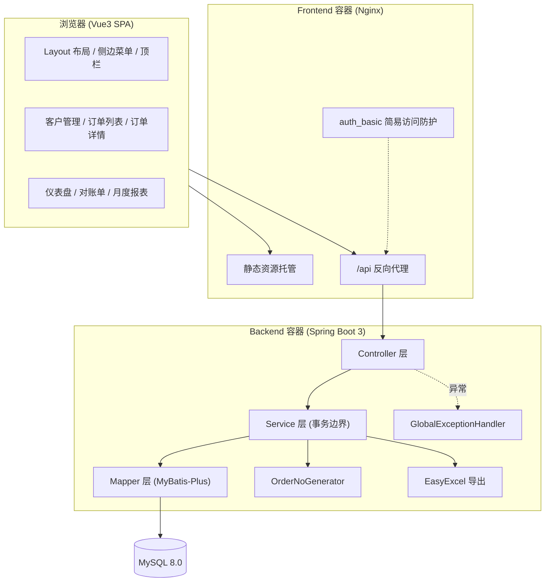

# 03 技术选型说明

## 3.1 选型总表

| 层 | 选型 | 版本 | 用途 |
| ---- | ---- | ---- | ---- |
| 运行时 | JDK | 17 (LTS) | Spring Boot 3 最低要求 |
| 后端框架 | Spring Boot | 3.2.x | 主体框架 |
| ORM | MyBatis-Plus | 3.5.x | 单表 CRUD、分页插件、Lambda 条件构造器 |
| 数据库 | MySQL | 8.0 | utf8mb4_unicode_ci |
| Excel | EasyExcel | 3.3.x | 对账单 / 月报导出 |
| 接口文档 | springdoc-openapi | 2.x | 自动生成 Swagger UI |
| 参数校验 | spring-boot-starter-validation | — | DTO 注解校验 |
| 监控 | Spring Boot Actuator | — | health / metrics 端点 |
| 构建 | Maven | 3.9+ | 依赖管理与构建 |
| 前端框架 | Vue 3 | 3.4.x | 组合式 API + `<script setup>` |
| 构建工具 | Vite | 5.x | 开发热更新与生产构建 |
| 语言 | TypeScript | 5.x | 前端类型安全 |
| UI 组件库 | Element-Plus | 2.x | 后台组件体系（按需自动导入） |
| 状态管理 | Pinia | 2.x | 全局状态 |
| 路由 | Vue Router | 4.x | 单页路由 |
| 图表 | ECharts 5 + vue-echarts | — | 账龄环形图、月度趋势图 |
| HTTP | Axios | 1.x | 接口请求封装 |
| Web 服务器 | Nginx | 1.25-alpine | 静态托管 + 反向代理 + auth_basic |
| 容器化 | Docker + Docker Compose | — | 三服务编排部署 |

## 3.2 关键选型取舍

### 3.2.1 EasyExcel vs Apache POI

| 维度 | EasyExcel | Apache POI |
| ---- | ---- | ---- |
| 内存占用 | 流式写，万行级稳定在数十 MB | 全量对象驻留内存，易 OOM |
| API 复杂度 | 注解驱动，声明式 | 需手工操作 Row/Cell |
| 学习成本 | 低 | 中 |

**结论：选 EasyExcel。** 对账单与月报导出面向中小企业数据量（千至万行），流式写足以覆盖，且 API 简洁、维护成本低。

### 3.2.2 MyBatis-Plus vs MyBatis

**结论：选 MyBatis-Plus。** 本项目大量单表 CRUD 与分页查询，MP 的 `BaseMapper` + 分页插件可省去大量模板代码；复杂统计（欠款三档、账龄、报表）仍走手写 XML SQL，两者可混用，无锁定风险。

### 3.2.3 权限方案：零代码 auth_basic

规划文档明确排除用户权限管理，但系统部署后若无任何访问控制，公网扫描风险极高。

可选方案对比：

| 方案 | 代码侵入 | 交付成本 | 适用 |
| ---- | ---- | ---- | ---- |
| Spring Security + RBAC | 高 | 高（含用户/角色/菜单管理页） | 超出本期范围 |
| 简单登录拦截 + Session | 中 | 中（需登录页、会话管理） | 侵入业务层 |
| **Nginx auth_basic** | **零** | **低（配置文件 + htpasswd）** | **符合本期范围** |

**结论：选 Nginx auth_basic。** 在反向代理层加一层 HTTP Basic 认证，业务代码零改动，后续若要升级为完整权限体系可直接替换该层，不产生技术债。

### 3.2.4 明确不引入的组件

| 组件 | 不引入理由 |
| ---- | ---- |
| Redis | 10 人并发单体部署，缓存收益低于运维成本 |
| 消息队列 | 无异步解耦场景，所有操作均为同步短事务 |
| 分布式锁 | 单体部署，订单号唯一性由数据库序列表 UPSERT 保证 |
| Spring Security | 见 3.2.3，采用零代码方案 |
| 前端 UI 框架之外的图表库 | ECharts 已覆盖环形图、柱状折线组合图需求 |

## 3.3 架构方案

**分层职责边界**

- **Controller**：仅做参数接收、DTO 校验、结果封装，**不含业务逻辑**
- **Service**：**唯一事务边界**，所有业务规则、状态校验、金额计算均落在此层
- **Mapper**：数据访问与聚合统计，不含业务判断

**关键约束**：禁止在 Controller 中组合调用多个 Service 方法完成一个业务动作，否则事务边界失效。

## 3.4 部署环境

| 环境 | 用途 | 配置 |
| ---- | ---- | ---- |
| local | 本地开发 | 后端 `mvn spring-boot:run`（8080）+ 前端 `npm run dev`（5173）+ 本机 MySQL |
| test | 集成测试 | `erp_test` 库，测试结束回滚 |
| prod | 生产 | Docker Compose 三容器，云服务器 2C4G 起步 |

**服务器最低规格**：2 核 4G、40G 系统盘、独立 20G 数据盘用于 MySQL 数据与备份。预估月成本 50 元量级（按国内云厂商轻量应用服务器）。

**时区统一策略**：数据库 `serverTimezone=Asia/Shanghai`、JVM `-Duser.timezone=Asia/Shanghai`、Docker 容器 `TZ=Asia/Shanghai`，三处统一避免日期错乱（原文档附录第 7 条缺陷）。

## 3.5 第三方服务

本期不依赖任何外部第三方服务（无短信、无对象存储、无支付、无地图）。所有数据本地闭环，降低运维复杂度与合规风险。

**备份存储**：`mysqldump` 落地宿主机本地磁盘，保留 30 天。如需异地容灾，可在运维阶段追加 `rclone` 同步到对象存储（本期不实现，仅预留）。
