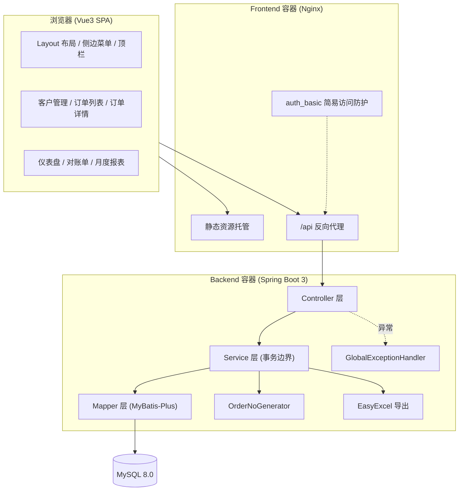

# 04 详细设计

## 4.1 系统架构



## 4.2 数据库设计

### 4.2.1 ER 关系

```
customers (1) ──┬── (N) orders ──┬── (1) shipments
                │                 │
                │                 └── (N) payments
                └── (N) order_items
```

1. 一个客户对应多个订单
2. 一个订单对应一条出货记录
3. 一个订单可有多条收款记录（分批收款）
4. 一个订单可有多个明细条目（本期仅建表）

### 4.2.2 表清单

| 表名 | 说明 | 本期是否开发 |
| ---- | ---- | ---- |
| `customers` | 客户 | 是 |
| `orders` | 订单 | 是 |
| `shipments` | 出货单 | 是 |
| `payments` | 收款记录 | 是 |
| `order_items` | 订单明细 | 否（仅建表） |
| `order_no_sequence` | 订单号按日序列表 | 是（新增） |

### 4.2.3 相对规划文档的 DDL 变更点

**orders 表新增字段**

```sql
ALTER TABLE orders
  ADD COLUMN customer_order_no VARCHAR(64) NULL COMMENT '客户订单号/PO号（选填，对账用）' AFTER order_no,
  ADD COLUMN due_date DATE NULL COMMENT '约定付款到期日（选填，仅展示）',
  ADD INDEX idx_customer_order_no (customer_order_no),
  ADD INDEX idx_cust_po (customer_id, customer_order_no);
```

**新增订单号序列表**

```sql
CREATE TABLE order_no_sequence (
    biz_date     DATE PRIMARY KEY COMMENT '业务日期',
    current_val  INT NOT NULL DEFAULT 0 COMMENT '当日已发放最大流水号',
    updated_at   DATETIME DEFAULT CURRENT_TIMESTAMP ON UPDATE CURRENT_TIMESTAMP
) COMMENT '内部订单号按日流水序列表';
```

其余 `customers` / `shipments` / `payments` / `order_items` 沿用规划文档 7.2 节 DDL；`orders.status` 保留 ENUM 约束作为数据层兜底。

完整 DDL 见 [`sql/init.sql`](../sql/init.sql)。

## 4.3 订单状态机设计

### 4.3.1 状态枚举

```java
public enum OrderStatus {
    DRAFT, PENDING(历史兼容), SHIPPED, PAID, CANCELLED;

    public boolean canShip()     { return this == DRAFT; }   // 直接发货
    public boolean canPay()      { return this == SHIPPED; }
    public boolean canCancel()   { return this == DRAFT; }   // 仅未发货可取消
    public boolean canEdit()     { return this == DRAFT; }
    public boolean countAsDebt() { return this == SHIPPED; }
}
```

**设计要点**：将所有状态可用动作收敛为枚举方法，杜绝业务代码中散落的 `if ("draft".equals(status))` 字符串比较，编译期即可约束，配合 `orders.status` ENUM 形成双重保障。发货为一步直达（draft → shipped），`PENDING` 仅为历史数据兼容保留。

### 4.3.2 状态流转表

| 动作 | 接口 | 前置 | 后置 | 副作用 |
| ---- | ---- | ---- | ---- | ---- |
| 确认发货（一步直达） | `POST /api/orders/{id}/ship` | draft | shipped | 插入/更新 `shipments`（实际发货日必填、物流单号选填，confirmed=1），形成应收 |
| 录入收款 | `POST /api/orders/{id}/pay` | shipped | shipped / paid | 插入 `payments`；累计 = 总额时转 paid |
| 取消订单 | `POST /api/orders/{id}/cancel` | draft | cancelled | 无 |

## 4.4 订单编号生成设计

### 4.4.1 规则

格式：`ORD + yyyyMMdd + 4位流水`，如 `ORD202609040001`，按日重置。

### 4.4.2 并发安全方案

采用**按日序列表 + 事务内 UPSERT 自增 + 唯一索引兜底重试**：

```sql
INSERT INTO order_no_sequence (biz_date, current_val) VALUES (?, 1)
  ON DUPLICATE KEY UPDATE current_val = current_val + 1;
SELECT current_val FROM order_no_sequence WHERE biz_date = ?;
```

- **原子性**：`INSERT ... ON DUPLICATE KEY UPDATE` 在 MySQL InnoDB 下为原子操作，并发不会取到相同流水号
- **兜底**：`orders.order_no` 唯一索引；捕获 `DuplicateKeyException` 后最多重试 3 次
- **事务一致性**：生成动作在创建订单的**同一事务**内执行，订单创建失败则流水号随事务回滚，不产生空洞（空洞可接受，不影响唯一性）

### 4.4.3 契约

```java
public interface OrderNoGenerator {
    String next(LocalDate bizDate);
}
```

前缀与流水位数抽为配置项 `erp.order-no.prefix` / `erp.order-no.seq-length`，便于后续替换规则。

## 4.5 欠款统计设计

### 4.5.1 金额模型

一次查询返回全部档位，避免多次扫表（发货简化后不再有 pending 档，仪表盘增加本月订单额）：

```java
public record DebtOverviewVO(
    BigDecimal draftAmount,       // 未发货金额（draft）
    BigDecimal monthOrderAmount,  // 本月订单额（不含取消）
    BigDecimal receivable,        // 应收欠款（仅 shipped 未结清）
    BigDecimal totalPaid,         // 累计已收（shipped+paid）
    List<AgingBucketVO> aging     // 逾期账龄五档：未到期 + 逾期四档
) {}
```

### 4.5.2 统计 SQL（修正 SUM 放大缺陷）

**错误写法**（规划文档原文，多笔收款时 `total_amount` 被放大）：

```sql
-- 错误：o LEFT JOIN p 后有 N 条收款行，SUM(o.total_amount) 被放大 N 倍
SELECT SUM(o.total_amount) - COALESCE(SUM(p.amount),0) FROM orders o
LEFT JOIN payments p ON o.id = p.order_id WHERE o.status='shipped';
```

**正确写法**（先按订单聚合收款，再相减）：

```sql
SELECT
  COALESCE(SUM(o.total_amount), 0) - COALESCE(SUM(t.paid_amount), 0) AS receivable
FROM orders o
LEFT JOIN (
  SELECT order_id, SUM(amount) AS paid_amount FROM payments GROUP BY order_id
) t ON o.id = t.order_id
WHERE o.status = 'shipped';
```

### 4.5.3 逾期账龄分布

以**约定收款日** `due_date` 为基准（未填回退发货日），按未结余额归属档位；设计上 SQL 只取数（`selectShippedDebtRows` 返回 balance/dueDate/shipmentDate），分档在 Java 侧完成（`DashboardService.bucketize`），规避 `DATEDIFF` 等 MySQL 专有函数：

```
基准日 = dueDate ?? shipmentDate
days   = 今天 − 基准日
days < 0            → 未到期
0   ≤ days ≤ 30     → 逾期 0-30 天
31  ≤ days ≤ 60     → 逾期 31-60 天
61  ≤ days ≤ 90     → 逾期 61-90 天
days > 90           → 逾期 90 天以上
```

各档金额合计恒等于应收欠款总额。

## 4.6 接口定义

统一响应结构：

```json
{ "code": 200, "msg": "success", "data": {} }
```

`code` 约定：`200` 成功 / `400` 参数或业务校验失败 / `500` 系统异常。

### 4.6.1 客户

| 方法 | 路径 | 说明 |
| ---- | ---- | ---- |
| GET | `/api/customers` | 分页列表，支持 name/contact/phone 模糊检索，附带欠款金额 |
| GET | `/api/customers/{id}` | 客户详情 |
| POST | `/api/customers` | 新增客户（name 唯一） |
| PUT | `/api/customers/{id}` | 修改客户 |
| DELETE | `/api/customers/{id}` | 删除客户（存在订单时拒绝） |
| GET | `/api/customers/all` | 下拉选择用全量客户（不分页） |

### 4.6.2 订单

| 方法 | 路径 | 说明 |
| ---- | ---- | ---- |
| GET | `/api/orders` | 分页列表：status / customerId / orderNo / customerOrderNo / 日期区间 |
| GET | `/api/orders/{id}` | 订单详情（含客户名、已收金额、出货、收款明细） |
| POST | `/api/orders` | 创建订单，内部单号自动生成 |
| PUT | `/api/orders/{id}` | 编辑订单，仅 draft 允许，金额等核心字段校验 |
| POST | `/api/orders/{id}/ship` | 确认发货（一步直达） draft→shipped |
| POST | `/api/orders/{id}/pay` | 录入收款，累计达额转 paid，超收拒绝 |
| POST | `/api/orders/{id}/cancel` | 取消订单 |
| POST | `/api/orders/{id}/check-po` | 校验同一客户下客户订单号是否重复（软提示） |

### 4.6.3 统计与报表

| 方法 | 路径 | 说明 |
| ---- | ---- | ---- |
| GET | `/api/dashboard` | 仪表盘：金额指标、逾期账龄分布、欠款 Top10 客户 |
| GET | `/api/reports/monthly` | 月度报表：订单量、出货量、回款额、完成率、趋势 |
| GET | `/api/reports/statement/{customerId}` | 客户对账单（支持日期区间、含已取消开关） |
| GET | `/api/reports/export/statement/{customerId}` | 导出对账单 Excel |
| GET | `/api/reports/export/monthly` | 导出月报 Excel |

## 4.7 后端模块划分

```
com.erp
├── common      Result / PageResult / BusinessException / GlobalExceptionHandler
├── config      MybatisPlusConfig(分页插件) / CorsConfig / JacksonConfig(BigDecimal 精度)
├── customer    CustomerController / CustomerService / CustomerMapper / entity.Customer / vo.CustomerVO
├── order       OrderController / OrderService / OrderMapper / entity.Order
│               OrderNoGenerator / enums.OrderStatus / dto.*
├── shipment    ShipmentService / ShipmentMapper / entity.Shipment
├── payment     PaymentService / PaymentMapper / entity.Payment
├── dashboard   DashboardController / DashboardService
└── report      ReportController / ReportService / excel.*
```

## 4.8 前端页面规划

| 路由 | 页面 | 主要内容 |
| ---- | ---- | ---- |
| `/dashboard` | 仪表盘 | 四张指标卡、账龄环形图、欠款 Top10 |
| `/customers` | 客户管理 | 检索、表格、新增编辑弹窗 |
| `/orders` | 订单列表 | 高级筛选、状态标签、行内动作 |
| — | 订单详情抽屉 | 状态时间轴、金额进度、出货信息、收款流水 |
| `/statement` | 客户对账单 | 对账摘要、折叠明细、Excel 导出 |
| `/monthly` | 月度报表 | 指标卡、趋势组合图、明细表、Excel 导出 |

## 4.9 关键设计约束

1. **金额精度**：全链路 `BigDecimal`，Jackson 序列化统一保留 2 位小数，**禁止 double**
2. **事务边界**：状态变更与关联记录写入必须在同一 Service 事务方法内
3. **日志**：统一 SLF4J；业务异常 WARN 级、系统异常 ERROR 级并携带订单号；禁止打印完整手机号
4. **索引利用**：列表筛选走 `idx_status` / `idx_customer` / `idx_order_date`；统计与导出限定时间范围
5. **范围控制**：`order_items` 仅建表；不引入权限、库存、采购等排除项
